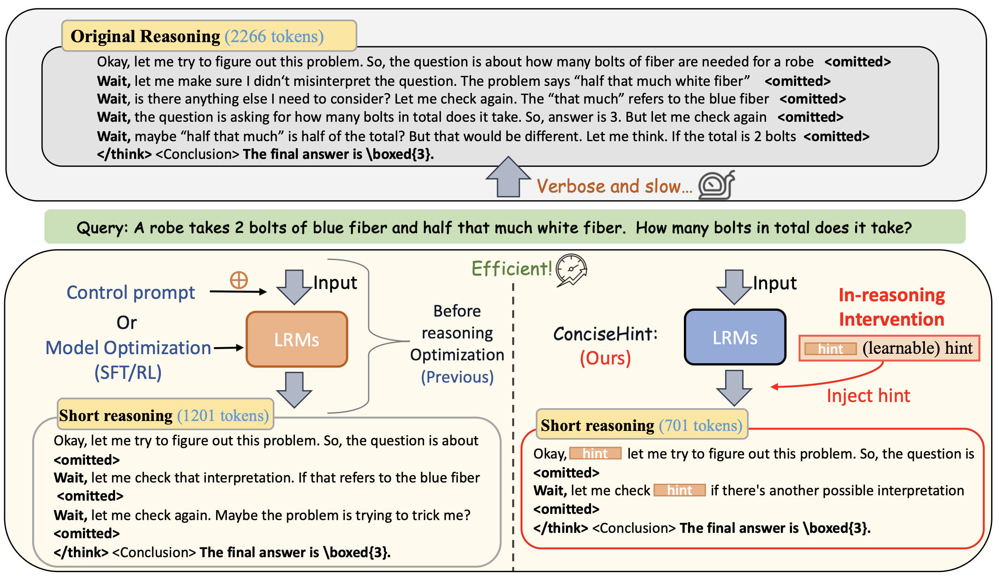

# ConciseHint: Boosting Efficient Reasoning via Continuous Concise Hints during Generation


<a href="https://arxiv.org/abs/2506.04158"></a>


> **ConciseHint: Boosting Efficient Reasoning via Continuous Concise Hints during Generation**
> <br>
> [Siao Tang](https://tsa18.github.io/), 
> [Xinyin Ma](https://horseee.github.io/), 
> [Gongfan Fang](https://fangggf.github.io/), 
> and 
> [Xinchao Wang](https://sites.google.com/site/sitexinchaowang/)
> <br>
> [xML Lab](https://sites.google.com/view/xml-nus), National University of Singapore
> <br>




We propose a framework dubbed  <strong>ConciseHint</strong>, which continuously encourages the reasoning model to speak concisely by injecting the textual hint (manually designed or trained on the concise data) during the token generation of the reasoning process.


## 🔧Setup

```bash
conda create -n concise_hint python=3.10 
conda activate concise_hint
pip install -r requirements.txt
```

## 🚀Run


### 1. Start the LLM server

```bash
CUDA_VISIBLE_DEVICES=0 vllm serve Qwen/Qwen3-4B --enable-reasoning \
--reasoning-parser deepseek_r1  --enable-prefix-caching --max_model_len 25000  --port 8000
```

### 2.1 Run concise hint

```bash
python -u run_main.py --model  Qwen/Qwen3-4B  --dataset gsm8k --repeat_exp_num 5  --max-tokens 10240  --bs 64  --port 8000 \
--enable_adap --enable_hint --exp Qwen3-4B-gsm8k-ours
```

### 2.2 Run baseline

```bash
python -u run_main.py --model  Qwen/Qwen3-4B  --dataset gsm8k --repeat_exp_num 5  --max-tokens 10240  --bs 64  --port 8000 --exp Qwen3-4B-gsm8k-base
```


## Main results
<div align="center">
  
   
</div>


## Note
This pape only includes the codes of the training-free ConciseHint. Please move to ConciseHint-T directory for the ConciseHint-T codes.

## Acknowledgement
The code framework is modified from the open-source github repository of Dynasor.